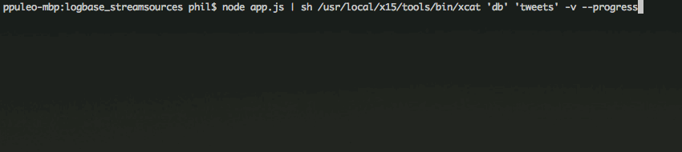

# logbase_streamsources
A collection of configurable streaming data sources for use as example data in X15

## Prerequisites
1. X15 server, UI, and tools
2. Node.js

## Usage
So far, Twitter is the only available source.

1. Clone this project and run `npm install` to get the project dependencies.
2. Download the [X15 dev environment file (.env)](https://drive.google.com/open?id=0B_stYpBM50nLN19ZMlA3OTh1ZkE) from Google Drive. Place it in the root of this project.
3. Set up a database and table in X15 where you would like to ingest the streaming Twitter data. Use a standard JSON parser spec.
4. Run the following command from the project root to start streaming data:

**MacOS**
```bash
$ node app.js | sh /usr/local/x15/tools/bin/xcat 'your_database' 'your_table' -v --progress
```

**Linux**
```bash
$ node app.js | sh /opt/x15/tools/bin/xcat 'your_database' 'your_table' -v --progress
```

**Example Output**


## Configuration
The Twitter stream is configured to filter tweets by keyword. I've chosen `['infosec',
    'iotsecurity', 'AI', 'BigData']` as the default. To change this, edit the **KEYWORDS** array in *streams/twitter/keywords/index.js*.
